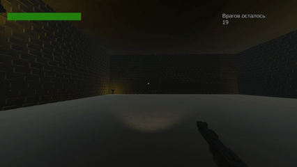
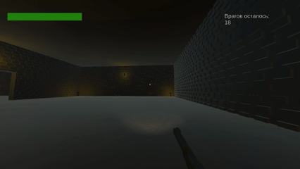
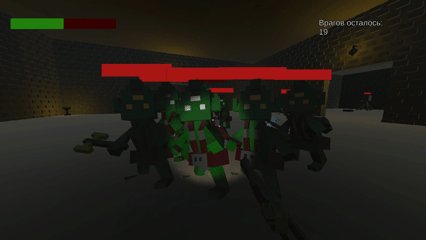
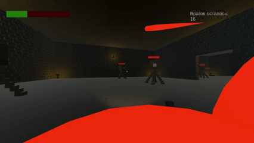

# Dungeon

3D arena-shooter с процедурной генерацией комнат и системой прогрессии.

Каждый забег — новый уровень: зачистка, награда, улучшения и повторный запуск.

* [Геймплей](#1-геймплей)

* [Особенности](#2-особенности)

* [Технологии](#3-технологии)

* [Генерация уровня](#4-генерация-уровня)

* [Оружие](#5-Оружие)

* [Враги](#6-функционал-и-интерфейс)

* [Как запустить](#7-инструкция-по-запуску)

## 1. Геймплей

* Генерируемый уровень из комнат
* Случайное количество врагов
* Победа после зачистки
* Магазин улучшений между забегами
* Тренировочный полигон с респавном врагов

## 2. Особенности

- процедурная генерация связного уровня

- физические projectile-пули вместо hitscan

- система улучшений между забегами

- тренировочный полигон с бесконечным респавном

- сохранение прогресса через SQLite

## 3. Технологии

Движок - Unity

Язык программирования - C#

База данных - SQLite для хранения прогресса игрока

## 4. Генерация уровня

Уровень представляет собой сетку NxN, где каждая новая комната размещается рядом с уже существующей.

Алгоритм:

1. В центре размещается стартовая комната

2. Выбираются все свободные соседние клетки

3. Случайная комната пытается встать в случайную позицию

4. Проверяются совпадающие двери

5. Если соединение возможно — комнаты связываются и двери удаляются

6. Иначе выбирается новая позиция (до лимита попыток)

Особенности:

- Нет изолированных комнат

- Всегда есть проход между соседями

- Разные формы уровней при каждом запуске

Внутри каждой комнаты генерируется случайное ненулевое количество врагов, а так же с некоторым шансом аптечки и освещение комнаты.

## 5. Оружие

Стрельба реализована через projectile-систему:

- каждая пуля — физический объект

- имеет скорость, время жизни и коллизию

- возможны промахи на дальних дистанциях

В игре существует три вида оружия

Каждое оружие имеет собственные параметры:

- урон

- скорострельность

- разброс

- скрытую ультимативную способность при полной прокачке

#### Пистолет

#### Дробовик

#### Автомат

## 6. Враги

В игре существует два вида врагов

#### Гоблины

Гоблины патрулируют комнаты, бегают за игроком, если он находится в зоне обнаружения и атакуют топором

#### Турели

Стреляют по игроку в радиусе обнаружения.

## 7. Как запустить

1. Перейти в раздел [Releases](https://github.com/Give-me-a-chance/Dungeon/releases).
2. Скачать архив последней версии (`Dungeon_v1.0.zip`).
3. Распаковать архив в удобное место.
4. Запустить файл `Release\Dungeon.exe`.

